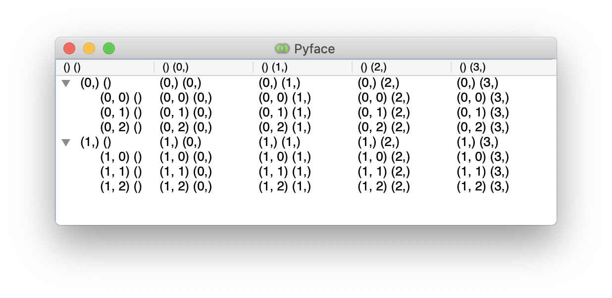
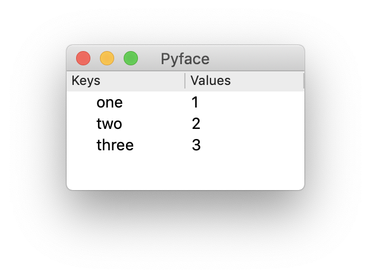

Pyface DataViews
=================

The Pyface DataView API allows visualization of hierarchical and
non-hierarchical tabular data.

Indexing
--------

The DataView API has a consistent way of indexing that uses tuples of integers
to represent the rows and columns, as illustrated below:

   How DataView Indexing Works.

A row index corresponds to a list of integer indexes at each level of the
hierarchy, so the empty tuple ``()`` represents the root of the hierarchy,
the tuples ``(0,)`` and ``(1,)`` give the two child rows of the root, while
``(0, 1)`` is the second child row of the first child of the root, and so on.

Column indices follow a similar pattern, but only have the root and one level
of child indices.

When interpreting these values, the root row ``()`` corresponds to the
*column* headers, the root column ``()`` corresponds to the *row* headers.
The root row and column indices together refer to the cell in the top-left
corner.

Index Managers
--------------

These indices need to be converted to and from whatever system the backend
toolkit uses for indexing and tracking rows.  This conversion is handled
by an |AbstractIndexManager| instance.  Pyface provides two of these which
efficiently handle the two common cases: |TupleIndexManager| is designed to
handle general hierarchical models, but needs to cache mementos for all rows
with children (and on Wx, for all rows); the |IntIndexManager| can only handle
non-hierarchical tables, but does so without needing any additional memory
allocation.

Unless you are creating a toolkit model or widget that uses the DataView
infrastructure it is sufficient to simply know to use the |IntIndexManager|
when you know that the data will always be a flat table, and |TupleIndexManager|
otherwise.

Data Models
-----------

Data to be viewed needs to be exposed to the DataView infrastructure by
creating a data model for it.  This is a class that implements the
interface of |AbstractDataModel| to display values from a dictionary.

   The DictDataModel example.

The basic traits for the model might look like this:

.. literalinclude:: examples/dict_data_model.py
   :start-at: class DictDataModel
   :end-at:     index_manager =

The base |AbstractDataModel| class requires you to provide an index manager
so we use an |IntIndexManager| because the data is non-hierarchical for this
model.

Data Structure
~~~~~~~~~~~~~~

The |get_column_count| method needs to be implemented to tell the toolkit
how many columns are in the data model.  For the dict model, keys are
displayed in the row headers, so there is just one column displaying the
value:

.. literalinclude:: examples/dict_data_model.py
   :start-at: def get_column_count
   :end-at: return

We can signal to the toolkit that certain rows can never have children
via the |can_have_children| method.  The dict data model is
non-hierarchical, so the root has children but no other rows will ever
have children:

.. literalinclude:: examples/dict_data_model.py
   :start-at: def can_have_children
   :end-at: return

We need to tell the toolkit how many child rows a particular row has,
which is done via the |get_row_count| method.  In this example, only the
root has children, and the number of child rows of the root is the length
of the dictionary:

.. literalinclude:: examples/dict_data_model.py
   :start-at: def get_row_count
   :end-at: return 0

Data Values
~~~~~~~~~~~

The |get_value| method is used to return the raw value for each location.
To get the values of the dict data model, we need to determine from the row
and column index whether or not the cell is a column header and whether
it corresponds to the keys or the values.  The code looks like this:

.. literalinclude:: examples/dict_data_model.py
   :start-at: def get_value
   :end-at: return value

Conversion of values into data channels is done by providing a value type
for each cell.  The |get_value_type| method provides an appropriate data
type for each item in the table.  For this data model we have three value
types: the column headers, the keys and the values.

.. literalinclude:: examples/dict_data_model.py
   :start-at: #: The header data
   :lines: 1-8

The default values of these traits are defined to be |TextValue| instances.
Users of the model can provide different value types when instantiating,
for example if the values are known to all be integers then |IntValue|
could be used instead for the ``value_type`` trait::

    model = DictDataModel(value_type=IntValue())

The |get_value_type| method uses the indices to select the appropriate
value types:

.. literalinclude:: examples/dict_data_model.py
   :start-at: def get_value_type
   :end-at: return self.value_type

Handling Updates
~~~~~~~~~~~~~~~~

The |AbstractDataModel| class expects that when the data changes, one of
two trait Events are fired.  If a value is changed, or the value type is
updated, but the number of rows and columns is unaffected, then the
``values_changed`` trait should be fired with a tuple::

    (start_row_index, start_column_index, end_row_index, end_column_index)

If a major change has occurred, or if the size, shape or layout of the data
has changed, then the ``structure_changed`` event should be fired with a
simple ``True`` value.

While it is possible that a data model could require users of the model to
manually fire these events (and for some opaque, non-traits data structures,
this may be necessary), where possible it makes sense to use trait observers
to automatically fire these events when a change occurs.

For example, we want to listen for changes in the dictionary and its items.
It is simplest in this case to just indicate that the entire model needs
updating by firing the ``structure_changed`` event [#]_:

.. literalinclude:: examples/dict_data_model.py
   :start-at: @observe('data.items')
   :end-at: self.structure_changed

Changes to the value types also should fire update events, but usually
these are simply changes to the data, rather than changes to the structure
of the table.  All value types have an updated event which is fired when
any state of the type changes.  We can observe these, compute which
indices are affected, and fire the appropriate event.

.. literalinclude:: examples/dict_data_model.py
   :start-at: @observe('header_value_type.updated')
   :lines: 1-11

Editing Values
~~~~~~~~~~~~~~

A model can flag values as being modifiable by implementing the
|can_set_value| function.  The default implementation simply returns
``False`` for all items, but subclasses can override this to permit
modification of the values.  For example, to allow modification of the
values of the dictionary, we could write:

.. literalinclude:: examples/dict_data_model.py
   :start-at: def can_set_value
   :end-at: return

A corresponding |set_value| method is needed to actually perform the changes
to the underlying values.  If for some reason it is impossible to set the
value (eg. an invalid value is supplied, or |set_value| is called with an
inappropriate row or column value, then a |DataViewSetError| should be
raised:

.. literalinclude:: examples/dict_data_model.py
   :start-at: def set_value
   :end-at: raise

Even though a data value may be modifiable at the data model level, the
value types also have the ability to control whether or not the value is
editable.  For example, subclasses of |EditableValue|, such as |TextValue|
and |IntValue| have an ``is_editable`` trait that controls whether the
value should be editable in the view (presuming that the underlying value
can be set).  Other value types can simply prevent editing by ensuring that
the |has_editor_value| method returns ``False``.

.. rubric:: Footnotes

.. [#] A more sophisticated implementation might try to work out
   whether the total number of items has changed, and if not, the
   location of the first and last changes in at least some of the
   change events, and then fire ``values_changed``.  For simplicty
   we don't try to do that in this example.

.. |AbstractIndexManager| replace:: :py:class:`~pyface.data_view.index_manager.AbstractIndexManager`
.. |AbstractDataModel| replace:: :py:class:`~pyface.data_view.abstract_data_model.AbstractDataModel`
.. |DataViewSetError| replace:: :py:class:`~pyface.data_view.abstract_data_model.DataViewSetError`
.. |EditableValue| replace:: :py:class:`~pyface.data_view.value_types.editable_value.EditableValue`
.. |IntIndexManager| replace:: :py:class:`~pyface.data_view.index_manager.IntIndexManager`
.. |IntValue| replace:: :py:class:`~pyface.data_view.value_types.numeric_value.IntValue`
.. |TextValue| replace:: :py:class:`~pyface.data_view.value_types.text_value.TextValue`
.. |TupleIndexManager| replace:: :py:class:`~pyface.data_view.index_manager.TupleIndexManager`
.. |can_have_children| replace:: :py:meth:`~pyface.data_view.abstract_data_model.AbstractDataModel.can_have_children`
.. |can_set_value| replace:: :py:meth:`~pyface.data_view.abstract_data_model.AbstractDataModel.can_set_value`
.. |get_column_count| replace:: :py:meth:`~pyface.data_view.abstract_data_model.AbstractDataModel.get_column_count`
.. |get_row_count| replace:: :py:meth:`~pyface.data_view.abstract_data_model.AbstractDataModel.get_row_count`
.. |get_value| replace:: :py:meth:`~pyface.data_view.abstract_data_model.AbstractDataModel.get_value`
.. |get_value_type| replace:: :py:meth:`~pyface.data_view.abstract_data_model.AbstractDataModel.get_value`
.. |has_editor_value| replace:: :py:meth:`~pyface.data_view.abstract_value_type.AbstractValueType.has_editor_value`
.. |set_value| replace:: :py:meth:`~pyface.data_view.abstract_data_model.AbstractDataModel.set_value`
