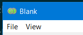
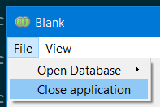
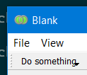

Let's start with a basic, blank task. The task does not contain any information
in the GUI.

.. code-block:: python

    from pyface.tasks.api import Task, EditorAreaPane
    from traits.api import Str

    class BlankTask(Task):
        """ A task that does nothing """

        # The task's identifier.
        id = Str("example.blank_task")

        # The task's user-visible name.
        name = Str("Blank")

        def create_central_pane(self):
            """ Create the central pane: the script editor.
            """
            self.editor_area = EditorAreaPane()
            return self.editor_area

Now let's add a new menu bar and a couple of empty menus to the task.

.. code-block:: python

    ...

    class BlankTask(Task):
        
        ...

        def _menu_bar_default(self):
            return MenuBarSchema(
                MenuSchema(
                    id="file",
                    name="&File",
                ),
                MenuSchema(
                    id="view",
                    name="&View",
                )
            )

.. note::

    Note that ``MenuBarSchema`` and ``MenuSchema`` are aliased as ``SMenu``
    and ``SMenuBar``. Similarly, ``GroupSchema`` and ``ToolBarSchema`` are
    aliased as ``SGroup`` and ``SToolBar``.

.. note::

    An empty ``MenuSchema`` will not be rendered in the Menu bar by the
    application.

    .. code-block:: python

        def _menu_bar_default(self):
            return MenuBarSchema(
                MenuSchema(),
            )

Let's now add additional menu items to the existing menus in the menu bar.

.. code-block:: python

    from pyface.tasks.action.api import TaskAction

    class BlankTask(Task):
        
        ...

        def exit(self):
            self.window.destroy()

        def _menu_bar_default(self):
            return MenuBarSchema(
                MenuSchema(
                    MenuSchema(
                        id="open_database",
                        name="&Open Database",
                    ),
                    TaskAction(
                        id="close_application",
                        name="&Close application",
                        method="exit",
                    ),
                    id="file",
                    name="&File",
                ),
                MenuSchema(
                    id="view",
                    name="&View",
                ),
            )

Let's now add a tool bar to the task.

.. code-block:: python

    from pyface.tasks.action.api import ToolBarSchema

    class BlankTask(Task):
        
        ...

        def _tool_bars_default(self):
            return [
                ToolBarSchema(
                    MenuSchema(
                        id="do_something",
                        name="&Do something",
                    ),
                )
            ]

Finally, our code like the following

.. literalinclude:: examples/menus_in_tasks_application.py
